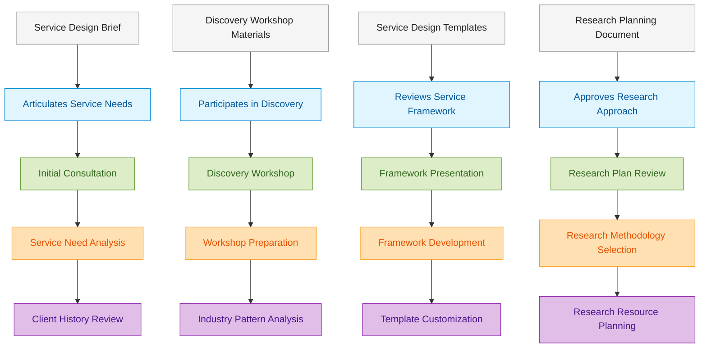
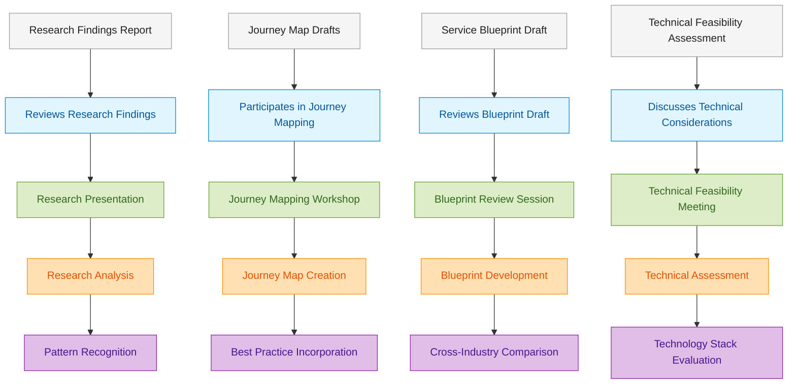
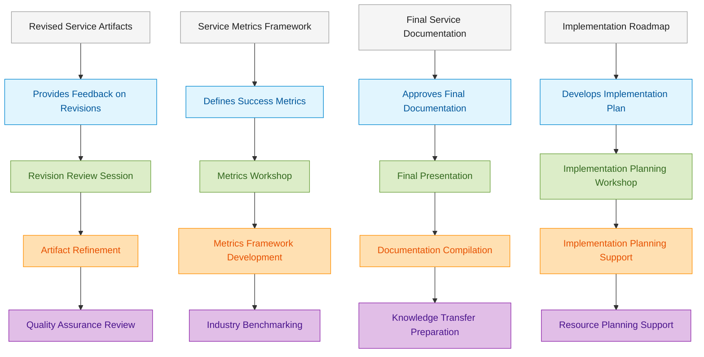
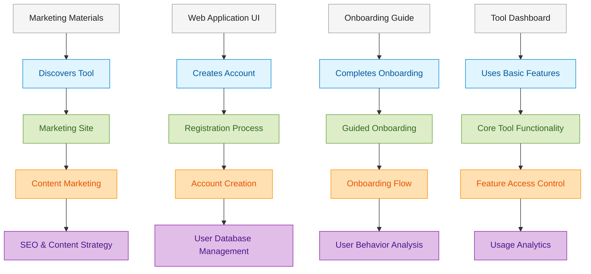
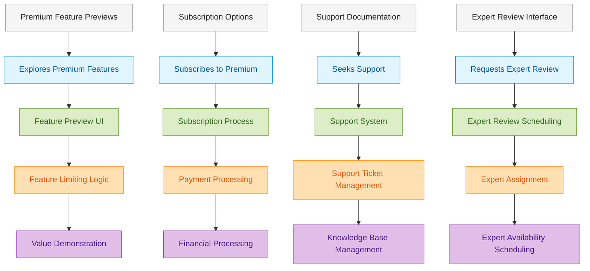
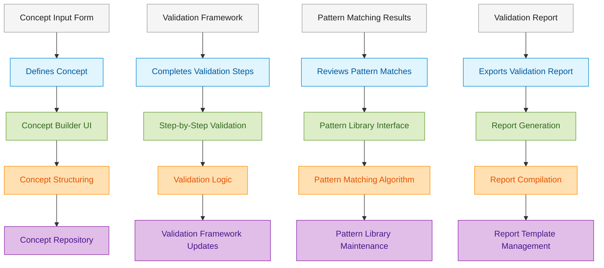
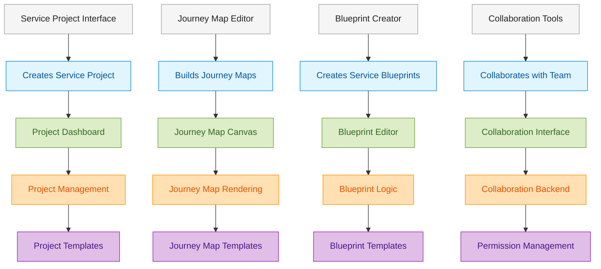

# Service Blueprint Supplements

This document contains service blueprints for the new service offerings added to RealHandy.tech's portfolio.

## Structured Service Design Service Blueprint

This blueprint outlines the process for delivering RealHandy.tech's Structured Service Design services.

### Service Goals
- Apply technical expertise to service design challenges
- Create comprehensive, technically feasible service documentation
- Bridge gap between service design and technical implementation
- Transfer service design methodology knowledge to clients
- Produce actionable service design artifacts that drive implementation

### Client Journey Phase Alignment
This blueprint covers the following phases from the client journey:
- **Service Design Discovery** (all stages)
- **Service Design Framework** (all stages)
- **Service Refinement & Documentation** (all stages)
- **Implementation Support & Evolution** (initial stages)

### Phase 1: Discovery & Framework

### Phase 2: Research & Design

### Phase 3: Refinement & Finalization

### Key Process Elements

#### Frontstage Elements
1. **Initial Consultation**: Understanding client's service design needs and context
2. **Discovery Workshop**: Collaborative exploration of service landscape and challenges
3. **Framework Presentation**: Presenting customized service design approach
4. **Journey Mapping Workshop**: Co-creation of customer journey maps
5. **Blueprint Review Sessions**: Iterative review of service blueprint components
6. **Technical Feasibility Meeting**: Assessment of implementation considerations
7. **Final Presentation**: Delivery of comprehensive service design package

#### Backstage Elements
1. **Service Need Analysis**: Interpreting client's service design requirements
2. **Workshop Preparation**: Creating customized workshop activities and materials
3. **Framework Development**: Adapting service design methodology to client context
4. **Research Analysis**: Processing user research data into actionable insights
5. **Journey Map Creation**: Developing visual representations of service journeys
6. **Blueprint Development**: Creating detailed service blueprints with technical considerations
7. **Documentation Compilation**: Assembling comprehensive service design documentation

#### Support Processes
1. **Pattern Recognition**: Applying experience from similar service design challenges
2. **Template Customization**: Adapting service design templates to client needs
3. **Quality Assurance Review**: Ensuring accuracy and completeness of deliverables
4. **Technology Stack Evaluation**: Assessing technical implementation considerations
5. **Knowledge Transfer Preparation**: Creating materials to build client capabilities

## RealHandy Software Tools Service Blueprint

This blueprint outlines the process for delivering RealHandy.tech's software tools, including the Concept Validation Guide and Service Designer Platform.

### Service Goals
- Provide scalable access to technical expertise through software
- Deliver self-service tools that incorporate decades of pattern recognition
- Create structured approaches to common technical challenges
- Offer multiple engagement levels from freemium to full-service
- Connect software tool users to advisory services when appropriate

### Client Journey Phase Alignment
This blueprint covers the following phases from the client journey:
- **Tool Discovery & Selection** (all stages)
- **Initial Value Realization** (all stages)
- **Premium Adoption** (all stages)
- **Integration & Expansion** (all stages)

### Common Software Tool Process

### Premium Conversion & Support Process

### Tool-Specific Processes

#### Concept Validation Guide Specific Process

#### Service Designer Platform Specific Process

### Key Process Elements

#### Common Elements
1. **Marketing Site**: Introduction to tool value proposition and features
2. **Registration Process**: Simple account creation with progressive information collection
3. **Guided Onboarding**: Step-by-step orientation to tool capabilities
4. **Core Tool Functionality**: Essential features available in freemium model
5. **Support System**: Help documentation and support request management
6. **Expert Review Integration**: Connection to advisory services when appropriate

#### Concept Validation Guide Specific Elements
1. **Concept Builder UI**: Interface for defining business concept components
2. **Step-by-Step Validation**: Guided process through validation framework
3. **Pattern Library Interface**: Access to similar historical patterns
4. **Validation Logic**: Algorithms for identifying concept risks and opportunities
5. **Report Compilation**: Generation of comprehensive validation documentation

#### Service Designer Platform Specific Elements
1. **Project Dashboard**: Management of service design projects
2. **Journey Map Canvas**: Visual editor for customer journey creation
3. **Blueprint Editor**: Interface for service blueprint development
4. **Collaboration Interface**: Tools for team collaboration on service design
5. **Template Management**: Library of service design templates and components
