# Service Blueprints

## Overview
These service blueprints detail the key processes for RealHandy.tech's service offerings. Each blueprint maps the visible client interactions (frontstage) and the internal processes that support them (backstage), creating a comprehensive view of service delivery.

## Strategic Technology Vision Service Blueprint

This blueprint outlines the process for delivering RealHandy.tech's Strategic Technology Vision services (formerly Fractional CTO services).

### Service Goals
- Provide pattern recognition from 20+ years of technology experience
- Deliver candid assessment of technical challenges and opportunities
- Create sustainable technical strategy aligned with business goals
- Build genuine investment in client success over time
- Transfer knowledge and perspective to enhance client decision-making

### Client Journey Phase Alignment
This blueprint covers the following phases from the client journey:
- **Initial Engagement** (referral through agreement)
- **Assessment & Agreement** (all stages)
- **Ongoing Relationship** (all stages)
- **Evolution & Expansion** (initial stages)

### Phase 1: Initial Engagement & Assessment

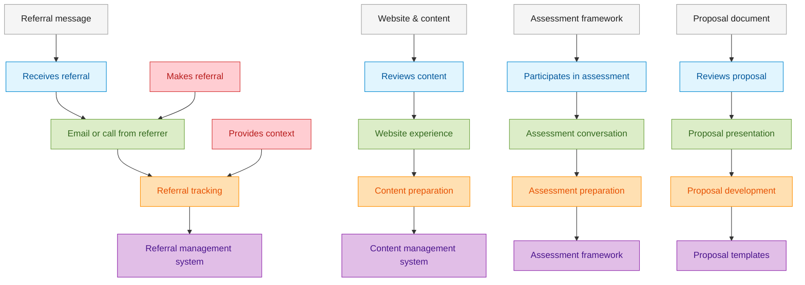

### Phase 2: Service Delivery & Relationship Development

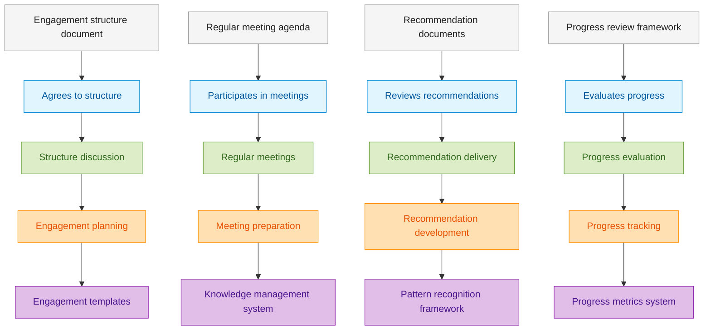

### Key Process Elements

1. **Referral Management**
   - Track and acknowledge referrals
   - Capture referral context
   - Provide feedback to referrers

2. **Initial Assessment**
   - Technical challenge identification
   - Pattern recognition application
   - Current state evaluation
   - Future state visioning

3. **Engagement Structure**
   - Retainer with work acceptance system
   - Clear deliverable definition
   - Expectations management
   - Communication cadence

4. **Ongoing Service Delivery**
   - Regular structured meetings
   - Strategic document development
   - Pattern application and knowledge transfer
   - Progress tracking and evaluation

5. **Relationship Evolution**
   - Deepening investment over time
   - Service expansion opportunities
   - Relationship maintenance strategy
   - Knowledge capture and reuse

## Technical Leadership Evolution Blueprint

This blueprint outlines the process for delivering RealHandy.tech's Technical Leadership Evolution services (formerly Mentoring).

### Service Goals
- Develop leadership capabilities in technical professionals
- Transfer 20+ years of leadership pattern recognition
- Create sustainable leadership practices and habits
- Build confidence in leadership approach
- Enable leaders to develop others effectively

### Client Journey Phase Alignment
This blueprint covers the following phases from the client journey:
- **Leadership Assessment** (all stages)
- **Leadership Development** (all stages)
- **Leadership Mastery** (all stages)
- **Leadership Scaling** (initial stages)

### Phase 1: Assessment & Development Planning

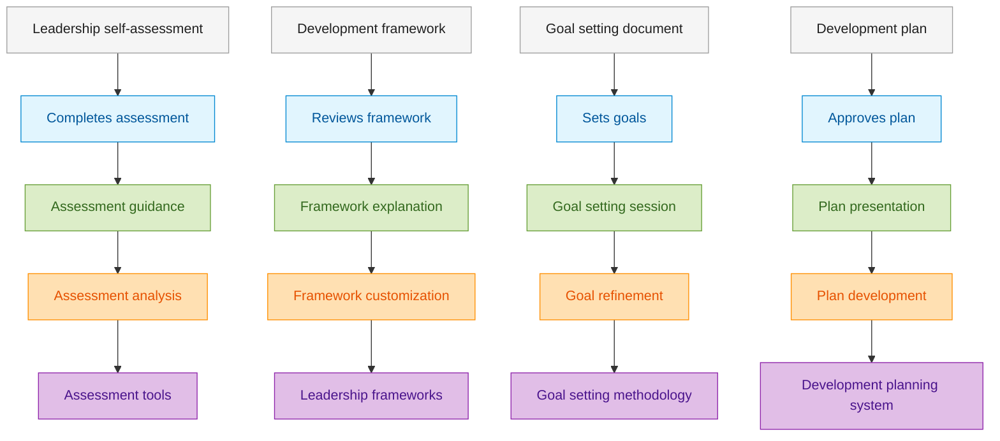

### Phase 2: Development & Implementation

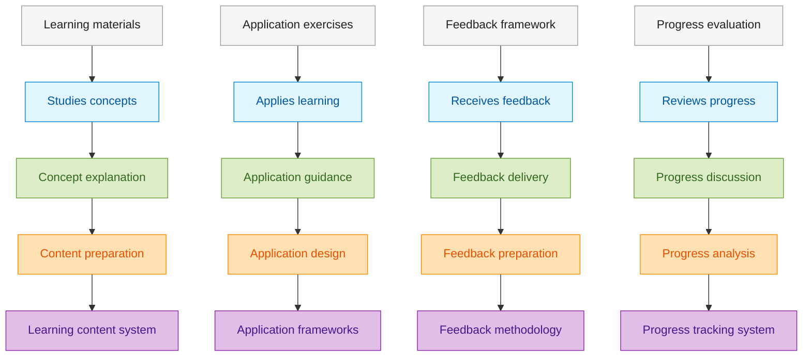

### Key Process Elements

1. **Leadership Assessment**
   - Self-assessment framework
   - Leadership style identification
   - Strength and growth area mapping
   - Context consideration

2. **Development Planning**
   - Goal setting methodology
   - Development pathway creation
   - Resource identification
   - Timeline and milestone establishment

3. **Learning Facilitation**
   - Concept explanation
   - Pattern recognition transfer
   - Historical context application
   - Knowledge integration

4. **Application Support**
   - Situation analysis
   - Application guidance
   - Feedback process
   - Adaptation methodology

5. **Progress Evaluation**
   - Milestone assessment
   - Progress metrics
   - Approach refinement
   - Long-term sustainability planning

## Leadership Journey Masterclass Blueprint

This blueprint outlines the process for delivering RealHandy.tech's Leadership Journey Masterclass offerings.

### Service Goals
- Scale leadership knowledge beyond one-to-one relationships
- Create structured, self-paced leadership development experience
- Deliver practical, applicable leadership techniques
- Build community of practice around leadership approaches
- Enable organizations to develop multiple leaders simultaneously

### Client Journey Phase Alignment
This blueprint covers the following phases from the client journey:
- **Course Discovery** (all stages)
- **Learning Experience** (all stages)
- **Skill Development** (all stages)
- **Implementation & Growth** (initial stages)

### Phase 1: Discovery & Enrollment

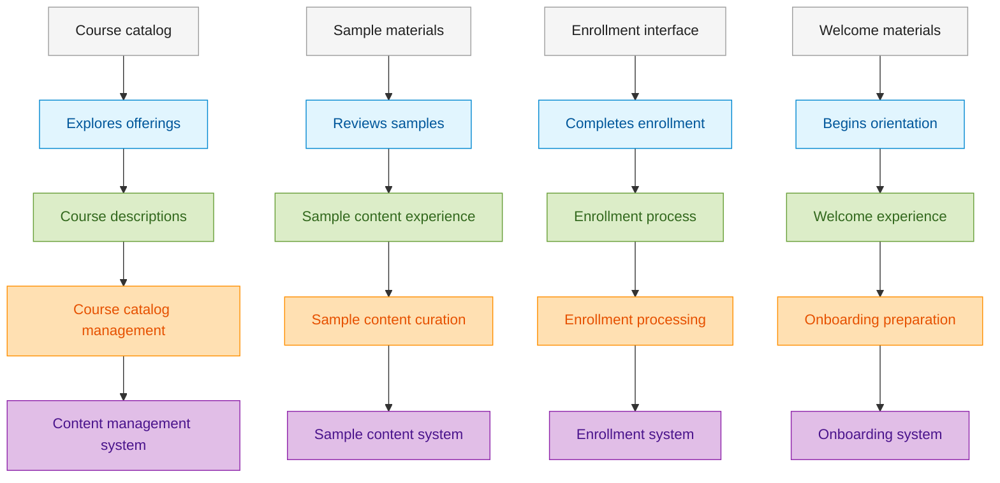

### Phase 2: Learning Experience & Application

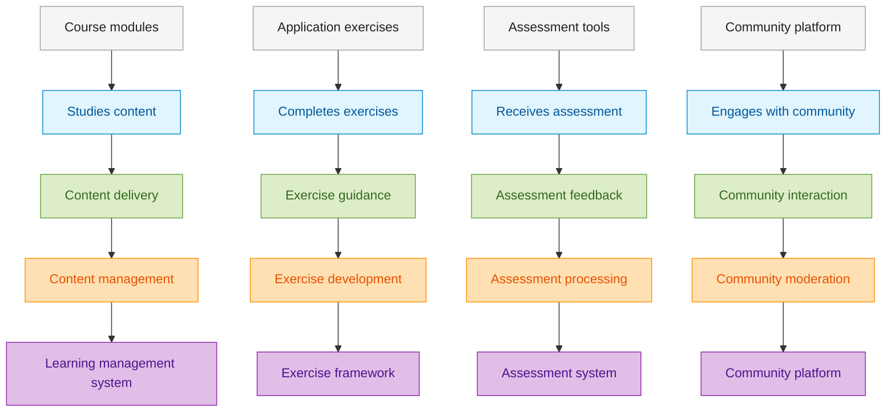

### Key Process Elements

1. **Course Development**
   - Content creation
   - Exercise design
   - Assessment development
   - Community facilitation planning

2. **Enrollment Management**
   - Course selection guidance
   - Enrollment processing
   - Welcome and orientation
   - Expectation setting

3. **Learning Facilitation**
   - Content delivery
   - Progress tracking
   - Concept reinforcement
   - Application guidance

4. **Application Support**
   - Exercise facilitation
   - Feedback provision
   - Assessment processing
   - Implementation guidance

5. **Community Management**
   - Discussion facilitation
   - Peer connection encouragement
   - Knowledge sharing support
   - Community growth and maintenance

## Team Evolution Program Blueprint

This blueprint outlines the process for delivering RealHandy.tech's Team Evolution Program offerings.

### Service Goals
- Transform technical team dynamics and effectiveness
- Instill servant leadership principles across the team
- Build sustainable team practices and culture
- Develop team resilience and problem-solving capabilities
- Create foundation for continuous team evolution

### Client Journey Phase Alignment
This blueprint covers the following phases from the client journey:
- **Team Assessment** (all stages)
- **Team Development Process** (all stages)
- **Team Evolution** (all stages)
- **Sustained Evolution** (initial stages)

### Phase 1: Assessment & Planning

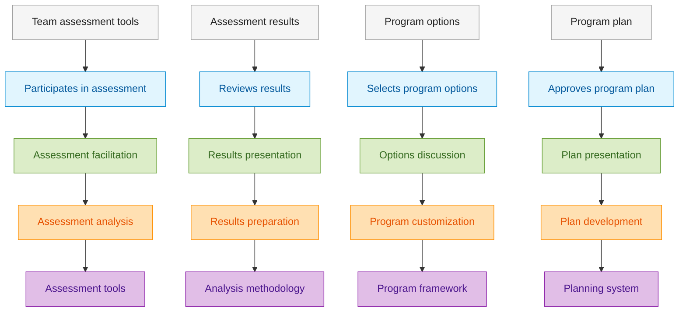

### Phase 2: Program Delivery & Integration

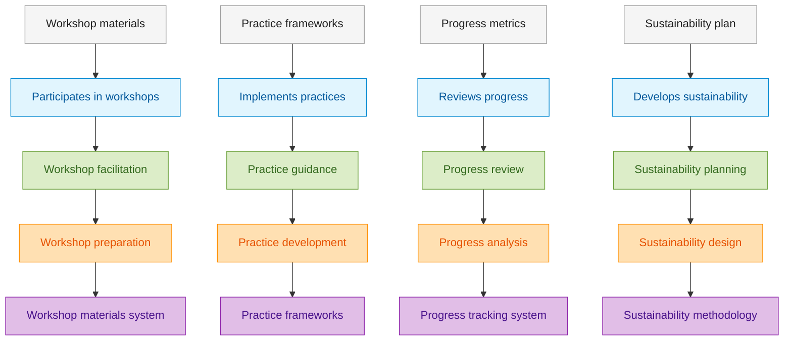

### Key Process Elements

1. **Team Assessment**
   - Current state evaluation
   - Challenge identification
   - Cultural assessment
   - Capability mapping

2. **Program Planning**
   - Goal setting
   - Intervention selection
   - Timeline development
   - Stakeholder alignment

3. **Workshop Delivery**
   - Concept introduction
   - Experiential learning
   - Team practice
   - Reflection facilitation

4. **Practice Integration**
   - Application guidance
   - Habit formation support
   - Obstacle navigation
   - Progress tracking

5. **Sustainability Development**
   - Internal champion development
   - Process integration
   - Measurement framework
   - Continuous evolution planning

## Structured Service Design Blueprint

This blueprint outlines the process for delivering RealHandy.tech's Structured Service Design services.

### Service Goals
- Apply technical expertise to service design challenges
- Create service designs that balance customer needs with implementation realities
- Develop comprehensive service documentation that guides implementation
- Build client capability for ongoing service evolution
- Connect service design to measurable business outcomes

### Client Journey Phase Alignment
This blueprint covers the following phases from the client journey:
- **Needs Assessment** (all stages)
- **Design Process** (all stages)
- **Implementation Planning** (all stages)
- **Ongoing Evolution** (initial stages)

### Phase 1: Discovery & Assessment

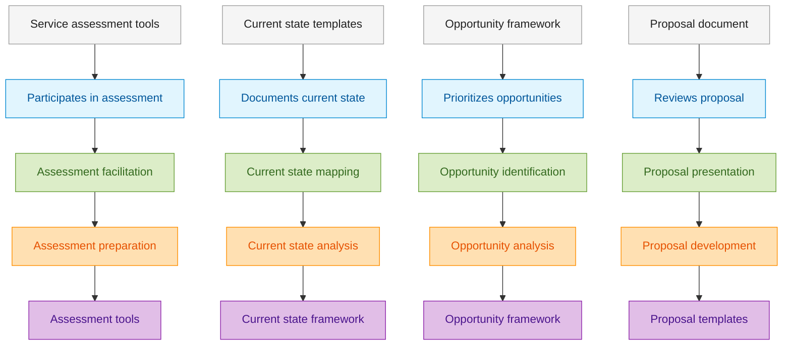

### Phase 2: Service Design Process

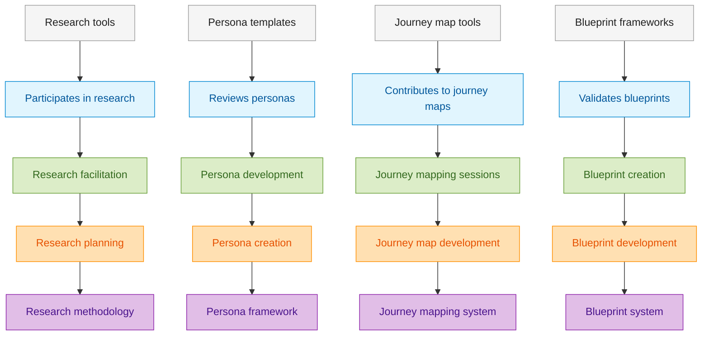

### Key Process Elements

1. **Service Assessment**
   - Current service evaluation
   - Opportunity identification
   - Service gap analysis
   - Technical feasibility assessment

2. **Service Research**
   - User research methodology
   - Stakeholder interviews
   - Competitive service analysis
   - Technical capability assessment

3. **Service Documentation**
   - Persona development
   - Journey mapping
   - Blueprint creation
   - Touchpoint design

4. **Implementation Planning**
   - Technical feasibility assessment
   - Resource planning
   - Timeline development
   - Stakeholder alignment

5. **Service Evolution**
   - Measurement framework
   - Feedback mechanisms
   - Iteration methodology
   - Capability development

## Concept Validation Tool Blueprint

This blueprint outlines the process for delivering RealHandy.tech's Concept Validation Guide tool.

### Service Goals
- Guide first-time founders through structured concept validation
- Help identify and test critical assumptions before significant resource investment
- Provide pattern recognition from decades of startup experience
- Enable data-driven decisions about concept viability
- Connect self-service tool users to advisory services when needed

### User Journey Phase Alignment
This blueprint covers the following phases from the user journey:
- **Tool Discovery & Onboarding** (all stages)
- **Validation Process** (all stages)
- **Concept Refinement** (all stages)
- **Execution Planning** (initial stages)

### Phase 1: Tool Discovery & Onboarding

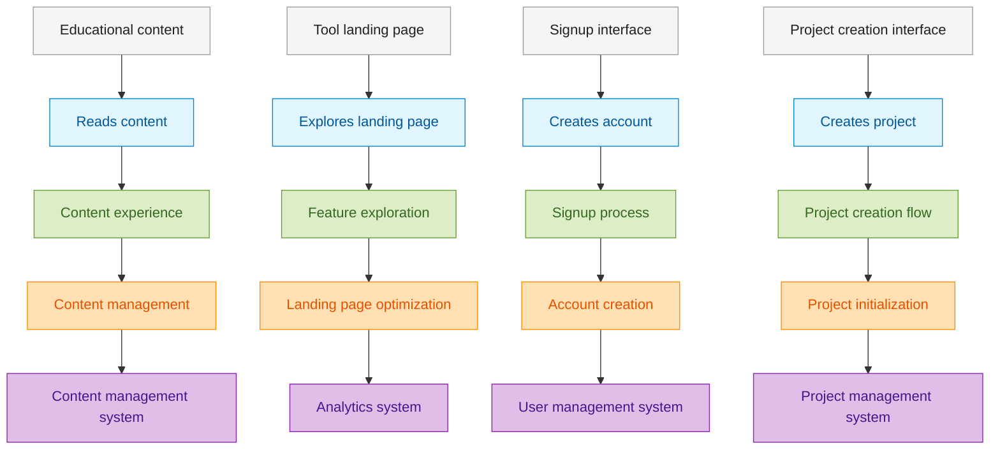

### Phase 2: Validation Process

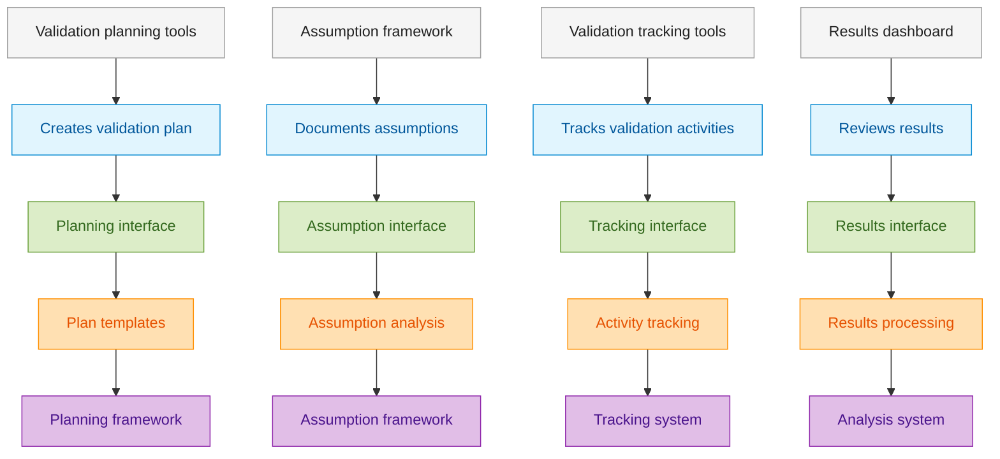

### Key Process Elements

1. **User Onboarding**
   - Value proposition communication
   - Account creation
   - Project initialization
   - Concept documentation

2. **Validation Planning**
   - Assumption identification
   - Validation methodology selection
   - Resource planning
   - Timeline development

3. **Validation Execution**
   - Activity tracking
   - Results documentation
   - Pattern recognition
   - Results analysis

4. **Concept Evolution**
   - Iteration guidance
   - Decision framework
   - Resource optimization
   - Execution planning

5. **Advisory Connection**
   - Expert guidance integration
   - Service connection
   - Handoff process
   - Continued support

## Service Designer Tool Blueprint

This blueprint outlines the process for delivering RealHandy.tech's Service Designer platform.

### Service Goals
- Provide efficient tools for comprehensive service design documentation
- Enable collaborative service design across teams
- Ensure technical feasibility of designed services
- Create living documentation that evolves with services
- Support service design with AI assistance and templates

### User Journey Phase Alignment
This blueprint covers the following phases from the user journey:
- **Platform Discovery & Setup** (all stages)
- **Service Documentation** (all stages)
- **Collaboration & Refinement** (all stages)
- **Delivery & Extension** (initial stages)

### Phase 1: Platform Discovery & Setup

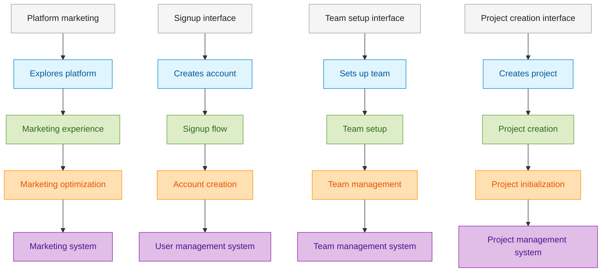

### Phase 2: Service Documentation

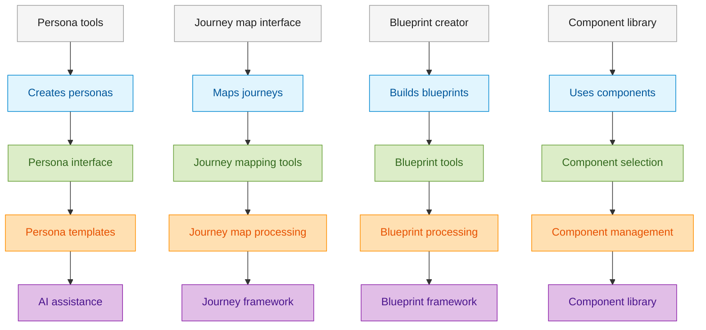

### Key Process Elements

1. **Platform Onboarding**
   - Value proposition communication
   - Account and team setup
   - Project initialization
   - Tool orientation

2. **Artifact Creation**
   - Persona development
   - Journey mapping
   - Blueprint creation
   - Component utilization

3. **Collaboration Management**
   - Team member collaboration
   - Feedback integration
   - Version control
   - Stakeholder sharing

4. **Documentation Export**
   - Format selection
   - Export processing
   - Implementation support
   - Evolution management

5. **AI Assistance**
   - Content generation
   - Pattern recognition
   - Consistency checking
   - Technical feasibility assessment
